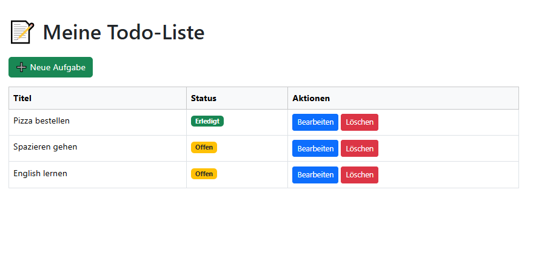

# 📝 Todo-Liste mit Spring Boot & Thymeleaf

Dies ist eine einfache Todo-App, die mit **Spring Boot**, **Thymeleaf** und einer **H2-In-Memory-Datenbank** entwickelt wurde. Sie demonstriert grundlegende Konzepte wie MVC-Architektur, CRUD-Operationen und JPA/Hibernate.

##  Features

- Aufgaben erstellen, anzeigen, bearbeiten und löschen
- Benutzerfreundliches UI mit Bootstrap
- Datenbankzugriff über Spring Data JPA
- H2-Konsole zur Datenbankinspektion
- Validierung und Statusanzeige

##  Screenshot




## 🛠️ Technologien

- Java 17
- Spring Boot
- Thymeleaf
- H2 Database
- Bootstrap 5

## 📦 Installation

```bash
git clone https://github.com/deinBenutzername/todo-springboot.git
cd todo-springboot
./mvnw spring-boot:run
````

Dann öffne im Browser: http://localhost:8080/todos  

## 📚 Lernziele

1. Verstehen des MVC-Patterns
2. Umgang mit Spring Boot und JPA
3. Aufbau eines Web-Frontends mit Thymeleaf
4. Deployment-Vorbereitung mit 
  
